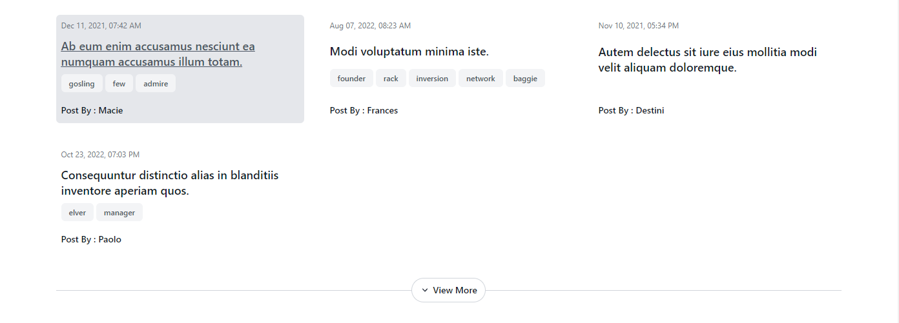

# Post Management Application

> **Note**: This application is a simple Post Management System built with React for the frontend and Express with TypeORM for the backend. It allows users to register, log in, create posts, and view posts with pagination and search functionality.

## Features

- User Registration: Users can register with a username and password.
- User Login: Users can log in to the system using their registered credentials.
- Create Posts: Authenticated users can create new posts.
- View Posts: Users can view a list of posts with pagination.
- Search Posts: Users can search posts by title and tags.
- Post Details: Users can view the details of a specific post.
- Load More: Users can load more posts incrementally.

## Prerequisites

- Node.js (TypeScript)
- React.js (TypeScript)
- Docker (for PostgreSQL database)
- pgAdmin (optional, for database management)

## Technologies Used

- Frontend: React, TypeScript, Tailwind css
- Backend: Node.js, Express, TypeORM
- Database: PostgreSQL (via Docker)
- Authentication: JWT (JSON Web Tokens)

## Setup and Installation

1. Clone the repository:

```bash
git clone https://github.com/6010110455/mydev-test-skinx.git
cd mydev-test-skinx
```

2. Install dependencies:

```bash
cd backend
npm install
cd ..
cd frontend
npm install
cd ..
```

3. run project:

- Open Docker Desktop
- run docker-compose up -d in home directory

```bash
docker-compose up -d
```

- If you run this project first time run seed for add posts data to database (It may take some time).

```bash
cd backend
npm run seed
```

4. frontend run on `http://localhost:3000`

## How to Use

1. Register a new user on the registration page.
   

2. Login with the registered credentials.
   

3. View the list of posts on the main page with pagination and load more function.
   
   

4. Search for posts by title or tags using the search bar.
   
   

5. Click on a post title to view its details.
   
